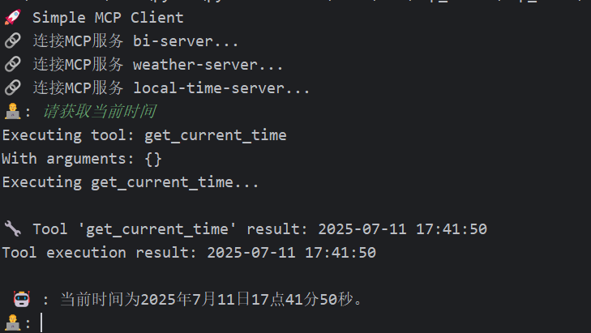
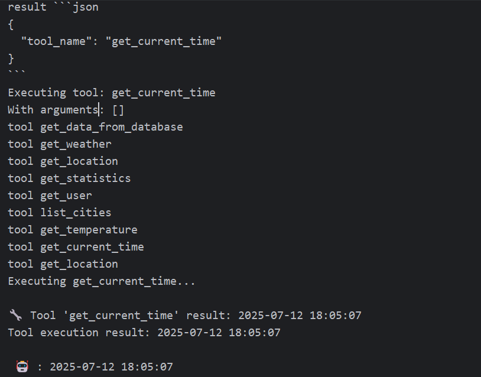

## MCP理论


### 定义与核心架构

​	MCP是由Anthropic提出的开放协议，旨在为大模型提供标准化接口，实现与外部工具如API、数据库、文件系统等的安全、高效连接。其核心特点包括：

- **架构**：采用**客户端-服务器模型**：

  - **主机（Client）**：用户使用的AI应用，如Claude Desktop，发起请求。
  - **服务器（Server）**：轻量级服务，连接具体数据源，如天气API、数据库。
  - **协议层**：基于JSON-RPC/gRPC通信，支持实时双向交互。

- **功能**：

  - **工具调用**：封装外部能力，如读取文件、调用API。
  - **资源访问**：安全读取类文件数据，如PDF解析。
  - **权限管控**：内置安全机制，隔离敏感数据。

  

### MCP使用过程


1. 
   1. 用户输入query到MCP 客户端，可以是cherrystudio 、claude desktop 也可以是开发者编写的client；
   2. 配置MCP工具库，工具库以Server的形式给出；
2. 调用LLM或者规则逻辑，目的是识别出用户的意图和对应的参数；
3. 返回工具库识别结果；
4. MCP工具库确认
5. 工具执行请求，传入工具名称、参数
6. 执行工具；
7. 返回工具执行结果；
8. 将工具执行结果返回给客户端；
9. 将工具执行结果和用户query等送入LLM，执行下一步操作。

### MCP定位

​		从技术角度看，MCP 遵循客户端-服务器架构，其中主机应用可以连接到多个服务器，即一对多。更形象的描述，MCP 可以看作是 AI 应用程序的 "USB-C端口"。就像 USB-C 为连接设备与各种外设提供了标准化方式，MCP为 AI 模型连接不同数据源和工具提供了标准化方法。这样可以**解耦客户端与服务端**，开发人员只需要**专注于按照MCP标准添加服务工具**，或者维护客户端以满足用户需求，而**不需要将大部分时间和工作精力集中在调用逻辑开发、接口开发等，也无需重复部署客户端，大大降低了开发量**。

​	


### 与传统API的优势

传统 API ：


* 如果 API 最初需要两个参数(例如天气服务的位置和日期)，用户集成应用程序会发送带有这些确切参数的请求。


- 如果后来添加第三个必需参数(例如温度单位，如摄氏度或华氏度)，API的合约就会改变。
- 这意味着所有 API 用户必须更新代码以包含新参数。如果不更新，请求可能失败、返回错误或提供不完整结果。

MCP 的设计解决了这个问题：

- MCP 引入了与传统 API 截然不同的动态灵活方法。
- 当客户端(如 Claude 桌面版)连接到 MCP 服务器(如您的天气服务)时，它发送初始请求以了解服务器的能力。


* 服务器响应其可用工具、资源、提示和参数的详细信息。例如，如果您的天气 API 最初支持位置和日期，服务器会将这些作为其功能的一部分进行通信。


* 如果您稍后添加unit参数，MCP 服务器可以在下一次交换期间动态更新其功能描述。客户端不需要硬编码或预定义参数—只需查询服务器的当前功能并相应地适应。

* 这样，客户端可以及时调整其行为，使用更新的功能(例如在请求中包含unit)，无需重写或重新部署代码。

### 和RAG、Agent的区别和联系

#### RAG

RAG通过**检索外部知识库**增强大模型生成能力，解决幻觉和知识过时问题：

- **流程**：
  1. **检索**：用数据库（如Milvus、Elasticsearch）匹配用户查询与知识库文档。
  2. **生成**：LLM结合检索结果生成答案。
- **优势**：数据驱动、低成本部署。
- **局限**：依赖知识库质量，无法处理动态任务。
- **典型应用场景**：
  - 企业知识库问答（如腾讯乐享整合内部文档）。
  - 法律/医疗咨询（引用权威资料）。

#### Agent

Agent是具备**自主决策能力**的AI系统，通过多步骤规划解决复杂问题：

- **流程**：
  - **规划**：拆解任务（如ReAct框架的"思考-行动-观察"循环）。
  - **执行**：调用工具（API、数据库）。
  - **反馈**：动态调整策略。
- **优势**：处理跨域任务（如客服全流程自动化）。
- **局限**：开发复杂度高，资源消耗大。
- **典型应用场景**：
  - 自动化工作流（如数据分析+报告生成）。
  - 动态环境交互（如特斯拉自动驾驶决策）。

#### 三者核心区别

| **维度**     | **MCP**                 | **RAG**                | **Agent**                    |
| :----------- | :---------------------- | :--------------------- | :--------------------------- |
| **核心目标** | 标准化工具/数据连接接口 | 通过检索增强生成准确性 | 自主执行多步骤任务           |
| **技术焦点** | 协议规范（如JSON-RPC）  | 语义检索+生成模型融合  | 规划决策+工具调用链          |
| **交互模式** | 被动响应请求            | 被动生成答案           | 主动规划与动态调整           |
| **依赖关系** | 工具生态兼容性          | 知识库质量与覆盖度     | 推理能力与工具链完整性       |
| **典型场景** | 实时API调用、跨系统集成 | 静态知识问答（如FAQ）  | 复杂流程自动化（如订单处理） |

#### **关键差异详解**

1. **功能定位**：
   - **MCP** 是"连接器"，提供标准化桥梁（如AI界的USB-C接口）
   - **RAG** 是"知识增强器"，解决LLM幻觉问题
   - **Agent** 是"执行者"，模拟人类决策闭环
2. **技术路径**：
   - **MCP** 需部署服务器（如文件系统MCP服务）
   - **RAG** 依赖检索技术（如LangChain向量化、字词检索）
   - **Agent** 需任务规划引擎（如LangGraph图结构）
3. **协作关系**：
   - **Agent可调用MCP**：例如用MCP工具读取数据库，再用Agent决策
   - **Agent集成RAG**：先检索知识库，再执行工具调用（如投资分析：RAG查市场报告 → Agent调用风险评估API）

#### 技术选型建议

- **选MCP**：需**安全连接企业系统**（如CRM/ERP封装为MCP服务）
- **选RAG**：构建**知识密集型问答**（如医疗文献检索）
- **选Agent**：处理**多步骤动态任务**（如电商客服：订单查询→退款→通知）
- **混合架构**：
  - **Agent+MCP**：复杂任务中按需调用工具（如MCP-Zero架构）
  - **Agent+RAG**：决策时增强实时知识（如法律Agent结合判例库）

### MCP典型应用场景

- 实时数据集成，如股票行情查询。
- 跨系统操作，如通过MCP连接GitHub、CRM系统。
- 企业级工具链标准化，降低重复开发成本。

# MCP实验

语言：python

框架：fastmcp==2.10.3、zhipuai==2.1.5.20250611、fastapi==0.115.12、transformers==4.53.0

## server

1.创建一个时间地点获取的server，命名为local_time_server.py

```python
import json
from fastmcp import FastMCP
import requests
import datetime
mcp = FastMCP("LocalTime",port=8002)
@mcp.tool(name="get_current_time",description="获取当前时间",)
def get_current_time():
    """获取当前时间并进行格式化展示:return:"""
    now = datetime.datetime.now()
    formatted_time = now.strftime("%Y-%m-%d %H:%M:%S")
    return formatted_time

@mcp.tool(name="get_location",description="获取当前地点",)
def get_location():
    """获取当前地点
    :return:"""
    try:
        response = requests.get("http://ip-api.com/json/")
        data = response.json()
        if data["status"] =="success":
            location_info = {"country": data.get("country",""),
                             "region": data.get("regionName",""),
                             "city": data.get("city","")}
            return json.dumps(location_info, ensure_ascii=False)
        else:
            return json.dumps({"error":"无法获取地理位置"}, ensure_ascii=False)
    except Exception as e:
        return json.dumps({"error":str(e)}, ensure_ascii=False)
```

2.创建一个数据库读取server，前提是开数据库服务。脚本命名为database_server.py

```python
# -*- coding: utf-8 -*-

from pydantic import BaseModel, Field
from typing import TypedDict
from fastmcp import FastMCP
import pymysql

database_opt_mcp = FastMCP("数据库操作服务",port=8002)


@database_opt_mcp.tool()
def get_data_from_database(sql_instruct: str):
    # "SELECT * FROM sys_menu"
    """获得数据库的数据"""
    db = pymysql.connect(host="127.0.0.1", user="root", password="Advanced@1992", database="mcp_test")
    cursor = db.cursor()
    cursor.execute("SELECT * FROM sys_menu")

    result = cursor.fetchall()
    for row in result:
        print(row)
    desc = cursor.description

    """Get various statistics"""
    return {"count": len(result), "columns": [k[0] for k in desc]}


if __name__ == '__main__':
    database_opt_mcp.run(transport="streamable-http")
```

3.创建一个天气预报server，命名为weather_server.py

```python
# -*- coding: utf-8 -*-

from pydantic import BaseModel, Field
from typing import TypedDict
from fastmcp import FastMCP
import pymysql

mcp_weather = FastMCP("天气预报服务",port=8001)


# Using Pydantic models for rich structured data
class WeatherData(BaseModel):
    temperature: float = Field(description="Temperature in Celsius")
    humidity: float = Field(description="Humidity percentage")
    condition: str
    wind_speed: float


@mcp_weather.tool()
def get_weather(city: str) -> WeatherData:
    """获取结构化的天气数据"""
    return WeatherData(
        temperature=22.5, humidity=65.0, condition="partly cloudy", wind_speed=12.3
    )


# Using TypedDict for simpler structures
class LocationInfo(TypedDict):
    latitude: float
    longitude: float
    name: str


@mcp_weather.tool(description="获取位置坐标")
def get_location(address: str) -> LocationInfo:
    return LocationInfo(latitude=51.5074, longitude=-0.1278, name="London, UK")


# Using dict[str, Any] for flexible schemas
@mcp_weather.tool()
def get_statistics(data_type: str) -> dict[str, float]:
    """获取各种数据"""
    return {"mean": 42.5, "median": 40.0, "std_dev": 5.2}


# Ordinary classes with type hints work for structured output
class UserProfile:
    name: str
    age: int
    email: str | None = None

    def __init__(self, name: str, age: int, email: str | None = None):
        self.name = name
        self.age = age
        self.email = email


@mcp_weather.tool()
def get_user(user_id: str) -> UserProfile:
    """获取用户配置文件"""
    return UserProfile(name="Alice", age=30, email="alice@example.com")


# Classes WITHOUT type hints cannot be used for structured output
class UntypedConfig:
    def __init__(self, setting1, setting2):
        self.setting1 = setting1
        self.setting2 = setting2


# Lists and other types are wrapped automatically
@mcp_weather.tool()
def list_cities(city_list) -> list[str]:
    """获取城市列表"""
    return ["London", "Paris", "Tokyo"]
    # Returns: {"result": ["London", "Paris", "Tokyo"]}


@mcp_weather.tool()
def get_temperature(city: str) -> float:
    """获取温度值"""
    return 22.5
    # Returns: {"result": 22.5}


if __name__ == '__main__':
    mcp_weather.run(transport="streamable-http")
```

server创建步骤：

1. 导入fasetmcp等必要依赖库；
2. 初始化一个FastMCP实例，设定对象名，端口名；
3. 定义装饰器及相应函数，定义工具名称、工具描述、工具启用禁用等；
4. 启动mcp示例，定义通信协议，可选为 ["stdio"， "streamable-http"]，其中stdio为本地通信，streamable-http为http通信

分析：

1. 格式完全相同

2. 同时开启以上三个服务，端口分别为8000，8001，8002

## client

### 简单调用

```python
import asyncio
from fastmcp import Client

client = Client("http://127.0.0.1:8002/mcp/")

async def call_tool(tool_name: str, *args) -> str:
    """Call a tool by name with given arguments."""
    result = await client.call_tool(tool_name, *args)
    print(f"{tool_name}({', '.join(map(str, args))}) = {result}")

async def run():
    """Run the client and call tools."""

    async with client:
        tools = await client.list_tools()
        print(f"Available tools: {', '.join(tool.name for tool in tools)}")

        await call_tool("get_current_time", {})

if __name__ == "__main__":
    asyncio.run(run())

#  打印结果
#tools [Tool(name='get_current_time', title=None, description='获取当前时间', inputSchema={'properties': {}, 'type': 'object'}, outputSchema=None, annotations=None, meta=None), Tool(name='get_location', title=None, description='获取当前地点', inputSchema={'properties': {}, 'type': 'object'}, outputSchema=None, annotations=None, meta=None)]
#Available tools: get_current_time, get_location
#get_current_time({}) = CallToolResult(content=[TextContent(type='text', text='2025-07-11 16:19:24', annotations=None, meta=None)], structured_content=None, data=None, is_error=False)

```

1. 连接8002端口；
2. client.list_tools：列出对应端口下的工具及参数；
3. client.call_tool：传入工具名称、参数，返回工具运行结果；

### 结合LLM工具识别

#### 基于ZhiPuAI api调用

```python
import asyncio
import json
import logging
import os
import shutil
from contextlib import AsyncExitStack
from datetime import timedelta
from typing import Any

from mcp import Tool, StdioServerParameters, stdio_client
from mcp.client.session import ClientSession
from mcp.client.streamable_http import streamablehttp_client
from zhipuai import ZhipuAI
llm_client = ZhipuAI(api_key="**********")  # 请填写您自己的APIKey
```

1. tools格式转换

```python
def convert_mcp_to_llm_tools(mcp_tools: list) -> list:
    """将MCP Server返回的工具列表转换为ZhiPuAI函数调用格式"""

    llm_tools = []

    for tool in mcp_tools:
        tool_schema = {
            "type": "function",
            "function": {
                "name": tool.name,
                "description": tool.description,
                "parameters": {}
            }
        }

        input_schema = tool.inputSchema
        print("input_schema",input_schema)
        parameters = {
            "type": input_schema['type'],
            "properties": input_schema['properties'],
            "required": input_schema['required'] if "required" in input_schema else [],
            "additionalProperties": False
        }
        for prop in parameters["properties"].values():
            # 特殊处理枚举值
            if "enum" in prop:
                prop["description"] = f"可选值: {', '.join(prop['enum'])}"

        tool_schema["function"]["parameters"] = parameters
        llm_tools.append(tool_schema)
    return llm_tools
```

2.建立Server管理类：

```python
class Server:
    """管理所有MCP Server的连接和工具执行"""

    def __init__(self, name: str, config: dict[str, Any]) -> None:
        self.name: str = name
        self.config: dict[str, Any] = config
        self.session: ClientSession | None = None
        self._cleanup_lock: asyncio.Lock = asyncio.Lock()
        self.exit_stack: AsyncExitStack = AsyncExitStack()

    async def initialize(self) -> None:
        """初始化所有 MCP Server"""
        try:
            # streamable-http 方式
            if "type" in self.config and self.config["type"] == "streamable-http":
                streamable_http_transport = await self.exit_stack.enter_async_context(
                    streamablehttp_client(
                        url=self.config["url"],
                        timeout=timedelta(seconds=60)
                    )
                )
                read_stream, write_stream, _ = streamable_http_transport
                session = await self.exit_stack.enter_async_context(
                    ClientSession(read_stream, write_stream)
                )
                await session.initialize()
                self.session = session
            # stdio 方式
            if "command" in self.config and self.config["command"]:
                command = (
                    shutil.which("npx")
                    if self.config["command"] == "npx"
                    else self.config["command"]
                )
                server_params = StdioServerParameters(
                    command=command,
                    args=self.config["args"],
                    env={**os.environ, **self.config["env"]}
                    if self.config.get("env")
                    else None,
                )
                stdio_transport = await self.exit_stack.enter_async_context(
                    stdio_client(server_params)
                )
                read, write = stdio_transport
                session = await self.exit_stack.enter_async_context(
                    ClientSession(read, write)
                )
                await session.initialize()
                self.session = session
            print(f"🔗 连接MCP服务 {self.name}...")
        except Exception as e:
            logging.error(f"❌ 初始化错误 {self.name}: {e}")
            await self.cleanup()
            raise

    async def list_tools(self) -> list[Tool]:
        """从MCP Server列出所有工具"""
        if not self.session:
            raise RuntimeError(f"Server {self.name} not initialized")

        tools_response = await self.session.list_tools()
        return tools_response.tools

    async def execute_tool(
            self,
            tool_name: str,
            arguments: str,
            retries: int = 2,
            delay: float = 1.0,
    ) -> str | None:
        """执行工具"""
        if not self.session:
            raise RuntimeError(f"Server {self.name} not initialized")
        arguments = json.loads(arguments) if arguments else {}
        attempt = 0
        while attempt < retries:
            try:
                print(f"Executing {tool_name}...")
                result = await self.session.call_tool(tool_name, arguments)
                if result.isError:
                    print(f"Tool error: {result.error}")
                print(f"\n🔧 Tool '{tool_name}' result: {result.content[0].text}")
                return result.content[0].text
            except Exception as e:
                attempt += 1
                print(
                    f"Error executing tool: {e}. Attempt {attempt} of {retries}."
                )
                if attempt < retries:
                    print(f"Retrying in {delay} seconds...")
                    await asyncio.sleep(delay)
                else:
                    logging.error("Max retries reached. Failing.")
                    raise
        return None

    async def cleanup(self) -> None:
        async with self._cleanup_lock:
            try:
                await self.exit_stack.aclose()
                self.session = None
            except Exception as e:
                logging.error(f"Error during cleanup of server {self.name}: {e}")
```

3.建立Client类：

```python
class Client:

    def __init__(self, servers: list[Server]):
        self.servers: list[Server] = servers
        self.llm_tools: list[dict] = []

    async def cleanup_servers(self) -> None:
        for server in reversed(self.servers):
            try:
                await server.cleanup()
            except Exception as e:
                print(f"Warning during final cleanup: {e}")

    async def get_response(self, messages) :
        """提交LLM，并获取响应"""
        try:
            # completion = llm_client.chat.completions.create(
            #     model="qwen3_32",
            #     messages=messages,
            #     tools=self.llm_tools,
            #     tool_choice="auto"
            # )

            response = llm_client.chat.completions.create(
                model="glm-4-plus",  # 请填写您要调用的模型名称
                messages=messages,
                tools=self.llm_tools,
                tool_choice="auto",
                stream=False,
                max_tokens=4096,
                temperature=0.8
            )
            # print(response)
            # for chunk in response:
            #     cont = chunk.choices[0].delta.content
            #     full_response += cont

            return response.choices[0].message

        except Exception as e:
            error_message = f"Error getting LLM response: {str(e)}"
            logging.error(error_message)
            return None

    async def start(self):
        """开始MCP Client"""
        for server in self.servers:
            # print(server)
            try:
                await server.initialize()
            except Exception as e:
                logging.error(f"Failed to initialize server: {e}")
                await self.cleanup_servers()
                return
        all_tools = []
        for server in self.servers:
            tools = await server.list_tools()
            all_tools.extend(tools)
        # 将所有工具转为llm格式
        self.llm_tools = convert_mcp_to_llm_tools(all_tools)
        print("self.llm_tools",self.llm_tools)
        # exit()
        await self.chat_loop()

    async def run(self, messages: list[Any], tool_call_count: int = 0, max_tools: int = 5):
        """获取LLM响应"""

        llm_response = await self.get_response(messages)
        # print("llm_response",llm_response)
        result = await self.process_llm_response(llm_response)
        if tool_call_count >= max_tools:
            # 强制结束并返回提示信息
            messages.append({
                "role": "assistant",
                "content": "已达到最大工具调用次数限制"
            })
        else:
            messages.append(result)
        return messages, result

    async def chat_loop(self):
        system_message = (
            "你是一个帮助人的AI助手。"
        )
        messages = [{"role": "system", "content": system_message}]
        tool_call_count = 0
        while True:
            try:
                user_input = input("👨‍💻: ").strip().lower()
                if user_input in ["quit"]:
                    print("\nExiting...")
                    break
                messages.append({"role": "user", "content": user_input})

                messege, result = await self.run(messages, tool_call_count)
                if result["role"] == "tool":
                    # await self.run(messages, tool_call_count)
                    tool_call_count += 1
                reply = messege[-1]["content"]
                print(f"\n 🤖 : {reply}")
            except KeyboardInterrupt:
                print("\n\n👋 Goodbye!")
                break
            except EOFError:
                break

    async def process_llm_response(self, llm_response) -> dict:
        """"""
        tool_call = llm_response.tool_calls
        print("tool_call", tool_call)
        if tool_call:
            tool_call = tool_call[0].function
            print(f"Executing tool: {tool_call.name}")
            print(f"With arguments: {tool_call.arguments}")
            for server in self.servers:
                tools = await server.list_tools()
                print("tools",tools)
                if any(tool.name == tool_call.name for tool in tools):
                    try:
                        result = await server.execute_tool(tool_call.name, tool_call.arguments)
                        print(f"Tool execution result: {result}")
                        return {"role": "tool", "content": result}
                    except Exception as e:
                        error_msg = f"Error executing tool: {str(e)}"
                        logging.error(error_msg)
        return {"role": "assistant", "content": llm_response.content}
```

4.修改相关参数

```json
{
  "mcpServers": {
    "bi-server": {
      "type": "streamable-http",
      "url": "http://127.0.0.1:8000/mcp"
    },
    "weather-server": {
      "type": "streamable-http",
      "url": "http://127.0.0.1:8001/mcp"
    },
    "local-time-server": {
      "type": "streamable-http",
      "url": "http://127.0.0.1:8002/mcp"
    }
  }
}
```

5.创建初始化函数

```python
async def main():
    # 读取mcp server配置文件
    with open("config.json", "r") as f:
        config = json.load(f)
    servers = [
        Server(name, srv_config)
        for name, srv_config in config["mcpServers"].items()
    ]
    print("🚀 Simple MCP Client")
    client = Client(servers)
    await client.start()
```

6.创建入口函数

```python
def cli():
    """CLI entry point for uv script."""
    asyncio.run(main())
```

运行结果：



#### 基于FastAPI 的LLM调用

1.基于fastapi开启LLM服务：

```python
import os
from starlette.responses import StreamingResponse
from transformers import TextIteratorStreamer
from threading import Thread
from fastapi import FastAPI, Request
from transformers import AutoTokenizer, AutoModelForCausalLM
import uvicorn
import json
import datetime
import torch
# 创建一个FastAPI应用程序实例
app = FastAPI()

model_name = r"**************"

model = AutoModelForCausalLM.from_pretrained(
    model_name,
    torch_dtype="auto",
    device_map="auto"
)
tokenizer = AutoTokenizer.from_pretrained(model_name)


#
@app.post("/")
async def create_item(request: Request):
    global model, tokenizer  # 声明全局变量以便在函数内部使用模型和分词器
    json_post_raw = await request.json()  # 获取POST请求的JSON数据
    json_post = json.dumps(json_post_raw)  # 将JSON数据转换为字符串
    json_post_list = json.loads(json_post)  # 将字符串转换为Python对象
    msg = json_post_list.get('contents')  # 获取请求中的提示
    max_length = json_post_list.get('max_length')  # 获取请求中的最大长度
    print(msg)
    # 构建输入
    input_tensor = tokenizer.apply_chat_template(msg, add_generation_prompt=True, return_tensors="pt")
    # 通过模型获得输出
    outputs = model.generate(input_tensor.to(model.device), max_new_tokens=max_length)
    result = tokenizer.decode(outputs[0][input_tensor.shape[1]:], skip_special_tokens=True)
    now = datetime.datetime.now()  # 获取当前时间
    time = now.strftime("%Y-%m-%d %H:%M:%S")  # 格式化时间为字符串
    # 构建响应JSON
    answer = {
        "response": result,
        "status": 200,
        "time": time
    }
    # 构建日志信息
    log = "[" + time + "] " + '", prompt:"' + msg[-1]["content"] + '", response:"' + repr(result) + '"'
    print(log)  # 打印日志

    # torch_gc()  # 执行GPU内存清理    return answer  # 返回响应
    return result


if __name__ == "__main__":
    uvicorn.run(app, host="0.0.0.0", port=int(os.environ.get("API_PORT", 7777)), workers=1)
```

2. tool识别和转换方式

   工具识别方式相同，格式转换方式更灵活只需方便后续prompt读取和使用即可：

   ```python
   def convert_mcp_to_llm_tools(mcp_tools: list) -> list:
       """将MCP Server返回的工具列表转换为LLM调用格式"""
   
       llm_tools = []
   
       for tool in mcp_tools:
           tool_schema = {"name": tool.name,
                          "description": tool.description,
                          "arguments": tool.inputSchema['required'] if "required" in tool.inputSchema else [],
                          }
   
           llm_tools.append(tool_schema)
       return llm_tools
   ```

3. Server端管理类和上一节方式相同，此处暂不赘述；

4. 建立Client类

如下几个函数有所区别：

* 调用大模型

```python
async def get_response(self, messages):
    """提交LLM，并获取响应"""

    # tool_desc_name = {unit["description"]: (unit["name"], unit["arguments"]) for unit in self.llm_tools}
    tool_name = {k: self.tool_desc_name[k][0] for k in self.tool_desc_name}
    tools_prompt = f"工具名称及对应的描述列表如下：{tool_name}"
    post_prompt = "请选择出与query最匹配的工具，返回json格式为：{'tool_name':工具名称}，如没有匹配工具，返回{'tool_name':None}\n"
    prompt = f"query如下：【{messages[-1]['content']}】\n" + post_prompt + tools_prompt
    messages[-1]['content'] = prompt
    print("messages", messages)
    try:
        payload = {
            "contents": messages,
            "max_length": 500,
            "temperature": 0.8
        }
        response = requests.post(url_api, json=payload)
        result = response.json()
        result = result.split('</think>')[-1].strip()
        print("result", result)
        return result
    except Exception as e:
        error_message = f"Error getting LLM response: {str(e)}"
        logging.error(error_message)
        return None
```

* 大模型结果后处理

  ```python
  def extract_dict_with_regex(self, input_str: str) -> dict:
      """
      使用正则表达式从字符串中提取字典
  
      参数:
          input_str (str): 包含字典的字符串
  
      返回:
          dict: 提取出的字典对象
      """
      # 正则表达式匹配Python字典
      # 匹配模式：{开头，}结尾，中间包含任意字符（非贪婪匹配）
      pattern = r'\{.*?\}'
      match = re.search(pattern, input_str, re.DOTALL)
  
      if not match:
          raise ValueError("未在字符串中找到有效的字典结构")
  
      # 提取匹配的字典字符串
      dict_str = match.group(0)
  
      # 将单引号转换为双引号使其符合JSON格式
      # 注意：仅转换键和值周围的引号，不转换内容中的单引号
      json_str = re.sub(r"'(.*?)'", r'"\1"', dict_str)
  
      # 解析JSON字符串
      return json.loads(json_str)
  ```

* tool调用

```python
async def process_llm_response(self, llm_response) -> dict:
    """"""
    # {'tool_name': 工具名称}
    llm_response = self.extract_dict_with_regex(llm_response)
    tool_call = llm_response["tool_name"]
    # self.tool_desc_name = {unit["description"]: (unit["name"], unit["arguments"]) for unit in self.llm_tools}
    # print("tool_call", tool_call)
    if tool_call:
        print(f"Executing tool: {tool_call}")
        print(f"With arguments: {self.tool_desc_name[tool_call][1]}")
        for server in self.servers:
            tools = await server.list_tools()
            for tool in tools:
                print("tool", tool.name)
            if any(tool.name == tool_call for tool in tools):
                try:
                    result = await server.execute_tool(tool_call, self.tool_desc_name[tool_call][1])
                    print(f"Tool execution result: {result}")
                    return {"role": "tool", "content": result}
                except Exception as e:
                    error_msg = f"Error executing tool: {str(e)}"
                    logging.error(error_msg)
    return {"role": "assistant", "content": llm_response.content}
```

识别结果：



时间仓促，难免有纰漏，欢迎批评指正，互相讨论。